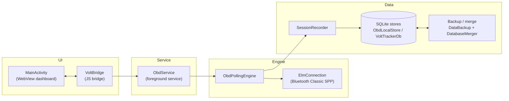

# Volt Tracker Android OBD POC

This is a standalone Android app for replacing Torque as the day-to-day OBD bridge.

It does three things:

1. Hosts a local Volt-style dashboard in an Android `WebView`.
2. Connects to a paired ELM327-style OBD2 adapter over Bluetooth Classic SPP.
3. Streams basic live OBD telemetry into the dashboard.

The app also includes a demo telemetry mode so the UI can be tested without a scanner.

## Codebase Map

Production source layout under `app/src/main/kotlin/com/volttracker/obdpoc/`:

| Layer    | Files                                                                       | What it does                                                      | Entry point                |
|----------|-----------------------------------------------------------------------------|-------------------------------------------------------------------|----------------------------|
| UI       | `MainActivity.kt`, `VoltBridge.kt`, `assets/dashboard/*`                    | Hosts the WebView; bridges TypeScript calls back to the service   | `MainActivity.onCreate`    |
| Service  | `ObdService.kt`, `ObdNotifications.kt`, `PermissionGate.kt`                 | Foreground lifecycle, status broadcasts, runtime permissions       | `ObdService.onStartCommand`|
| Engine   | `ObdPollingEngine.kt`, `SessionRecorder.kt`, `ObdProtocol.kt`, `ElmConnection.kt`, `ObdElmDecode.kt`, `ObdProbes.kt`, `location/*` | Bluetooth IO, ELM327 init, polling loop, parsing, GPS | `ObdPollingEngine.runBluetoothLoop` |
| Data     | `data/*` (`ObdLocalStore`, `VoltTrackerDb`, `ObdStoreReports`, `ObdStoreTrips`, `ObdStoreSupport`, record DTOs) | SQLite schema, writes, queries, JSON projections for the dashboard | `ObdLocalStore`            |

Calls flow downward only (UI → Service → Engine → Data). See
[`docs/mobile-architecture-roadmap.md`](docs/mobile-architecture-roadmap.md#layering-rule)
for the full rule, and [`docs/adr/0001-webview-dashboard.md`](docs/adr/0001-webview-dashboard.md)
for why the dashboard is a WebView rather than Compose.

The dashboard `index.html` is generated by the Gradle `generateDashboardHtml`
task from `app/src/main/dashboard-src/partials/*.html`. Edit the partials, never
the generated file.

## Architecture

How the layers above connect at runtime (control path left-to-right, data path
branching off the polling engine):



The dashboard TypeScript calls into `VoltBridge` (the JavaScript interface
injected into the WebView); telemetry and status flow back to the page through
`DashboardPublisher`, which invokes allowlisted `window.VoltTrackerNative.*`
entry points. Everything below `ObdService` keeps running while the app is
backgrounded, which is why it is a foreground service.

### Dashboard screenshots

These are the committed Playwright visual-regression baselines (rendered at a
phone-like viewport on Linux CI), linked in place from
[`dashboard-e2e/`](dashboard-e2e/) — they refresh automatically whenever an
intentional UI change lands:

| Drive tab (typical telemetry) | Charge tab (sessions + detection) | Insights tab (full page) |
|---|---|---|
|  |  |  |

Solid magenta blocks are Playwright screenshot masks over nondeterministic
regions (live charts, Leaflet map tiles) — on a phone those areas show the
real chart/map.

## Setup

Use the pinned toolchain before running the full verification task:

- JDK 21. CI uses Temurin 21.
- Android SDK with platform 36 and build tools installed.
- Node 22. The root `.nvmrc` and `.node-version` both pin this.
- npm dependencies for the dashboard test/build workspace.

From `mobile/android/`:

```sh
npm --prefix dashboard-tests ci
./gradlew verifyActiveApp
```

Useful local tasks:

```sh
./gradlew generateDashboardHtml          # rebuild assets/dashboard/index.html from partials
./gradlew verifyGeneratedDashboardClean  # fail if generated HTML is stale
./gradlew :app:spotlessApply             # format Kotlin/Java and dashboard partials
./gradlew :app:testDebugUnitTest         # JVM/Robolectric unit tests
```

For install/release packaging details, see [`docs/release.md`](docs/release.md).
For common field failures, see [`TROUBLESHOOTING.md`](TROUBLESHOOTING.md).
Domain terms are defined in [`docs/glossary.md`](docs/glossary.md).

## Language Policy

Production Android source stays in `app/src/main/kotlin`; do not add production
Java back under `app/src/main/java`. Dashboard behavior source stays in
`app/src/main/dashboard-src/js/*.ts`; do not add source `.js` files there. The
Gradle `verifyNoMigrationSourceStragglers` task enforces both rules, and
`verifyActiveApp` runs that guard with the rest of the local validation suite.

## On-Phone Storage

The app now writes two layers of local data:

- Raw field-test JSONL files under app-private `files/obd-logs/`.
- Structured SQLite data in `volttracker_obd_poc.db`.

SQLite tables capture OBD sessions, parsed telemetry samples, status/debug events, and adapter history summaries. The Settings screen shows a database summary so field tests can confirm whether sessions and samples are being saved without pulling files from the phone.

For the data/privacy model, backup contents, and map tile network behavior, see
[`docs/privacy-data-handling.md`](docs/privacy-data-handling.md).

## Current PIDs

Live polling is tiered in `PidSchedule.kt`; every published sample carries
stale-age metadata so slower values can be shown honestly without slowing the
speed/RPM path.

| Lane | Cadence | PIDs |
|------|---------|------|
| Hot | Every cycle | `010D` speed, `010C` RPM, `0149` accelerator pedal, `222414` HV pack current |
| Warm | Every 2 cycles | `0104` engine load, `0111` ICE throttle, `222429` HV pack voltage |
| Slow | Every 6 cycles | `015B` hybrid battery SOC, `ATRV` adapter voltage |
| Thermal | Every 12 cycles | `0105` coolant temp, `22434F` HV battery temp |
| Deep | 24+ cycles | control-module voltage, run time, fuel/oil/odometer context, motor currents/voltages, PRNDL, charger HV voltage/current, charging mode/level, raw SOC, charge count, last-charge energy, and other validated context |

Diagnostic Scan and Detail Probe still exist for broader discovery, including
candidate TPMS probes. Do not promote new community Mode-22 formulas into live
polling until they have fresh field evidence from the target car.

## Build

From this directory:

```sh
# macOS / Linux
./gradlew :app:assembleDebug
```

```powershell
# Windows
.\gradlew.bat :app:assembleDebug
```

The debug APK will be at:

```text
app/build/outputs/apk/debug/app-debug.apk
```

### Pre-commit hooks (optional)

Run Spotless locally before each commit so format failures surface before CI:

```sh
brew install lefthook && lefthook install
```

### Full local verification

Before opening a PR, run the active-app verification task:

```sh
npm --prefix dashboard-tests ci
./gradlew verifyActiveApp
```

This runs Android unit tests, lint, Spotless, debug assemble, JaCoCo coverage,
dashboard ESLint/typecheck/Vitest, Playwright e2e, bundle budgets, generated
dashboard drift, and migration straggler guards. See
[`docs/validation-matrix.md`](docs/validation-matrix.md) for what this proves
and which real-device/real-car checks still need separate evidence.

Dashboard tooling is validated on Node 22 in CI. Use the root `.nvmrc` or
`.node-version` when setting up a local shell.

The aggregate task is configuration-cache ready. For faster repeated local
loops, run `./gradlew verifyActiveApp --configuration-cache`; the second run
should reuse the stored configuration.

### Environment doctor

Run the no-network doctor when a new machine or agent shell behaves differently
from CI:

```sh
./scripts/doctor.sh
```

It reports Java, Android SDK, adb/device, Node/npm, dashboard dependency, and
Playwright readiness without installing anything.

#### Running pieces individually

```sh
./gradlew :app:testDebugUnitTest                 # JVM/Robolectric unit tests
./gradlew :app:jacocoTestReport                  # coverage report (build/reports/jacoco/)
npm --prefix dashboard-tests run test:coverage   # dashboard Vitest + Istanbul coverage
```

`jacocoTestCoverageVerification` enforces a coverage floor that a PR must clear:
**71% line coverage project-wide** and **89% for the `data/` package** (the
append-only persistence layer is held to a higher bar). The dashboard Vitest
suite has its own Istanbul thresholds in `dashboard-tests/vitest.config.js`.

### Outdated dependency report

List outdated direct and transitive dependencies (advisory; nothing fails):

```sh
./gradlew dependencyUpdates -Drevision=release
```

Dependency snapshots and other dated audits are indexed in
[`docs/reports-index.md`](docs/reports-index.md).
The scheduled `Dependency snapshot` workflow refreshes the Gradle release
dependency report plus dashboard/e2e npm outdated and audit artifacts weekly.

## Install On A Phone

1. Pair your OBD adapter in Android Bluetooth settings.
2. Enable Developer Options and USB debugging.
3. Plug in the phone and accept the USB debugging prompt.
4. Run:

```sh
# macOS / Linux
adb devices
./gradlew :app:installDebug
```

```powershell
# Windows
adb devices
.\gradlew.bat :app:installDebug
```

Optional phone mirroring:

```sh
scrcpy
```

## Current Notes

- The app intentionally keeps a small dependency surface. Runtime code directly
  ships AndroidX Core for `FileProvider`, notification/service compatibility,
  and package-version helpers; test code uses JUnit, Robolectric, and `org.json`.
- Bluetooth permissions are requested at runtime on Android 12+.
- A foreground service keeps the OBD session alive while polling.
- The WebView only loads local assets from `app/src/main/assets/dashboard`.
- The Map and Trips route views use remote CARTO basemap tiles by default, with
  OpenStreetMap fallback when CARTO is unavailable. Route, OBD, and GPS history
  still come from on-device storage, but tile providers can see requested tile
  coordinates.
- The service uses the standard ELM327 serial UUID: `00001101-0000-1000-8000-00805F9B34FB`.

Fresh graded audits are written to `.claude/grade-report.md`, which is
repo-local and gitignored. Historical tracked reports remain under `docs/`.

## Pulling Field-Test Logs

Every connect or demo session writes JSONL logs on the phone under app-private storage:

```text
files/obd-logs/session-*.jsonl
files/obd-logs/latest.txt
```

After reconnecting the phone with USB debugging:

```powershell
$pkg = "com.volttracker.obdpoc"
$out = "C:\Users\Justin\OneDrive\Documents\Github\VoltTracker\mobile\android\field-test-latest.jsonl"
$latest = adb shell run-as $pkg cat files/obd-logs/latest.txt
adb exec-out run-as $pkg cat "files/obd-logs/$latest" > $out
```

Those logs include status transitions, connection failures, every ELM327 command and response, parsed telemetry samples, timing, empty responses, and whether the adapter prompt (`>`) was seen.

The SQLite database can also be pulled after a test:

```powershell
$pkg = "com.volttracker.obdpoc"
$out = "C:\Users\Justin\OneDrive\Documents\Github\VoltTracker\mobile\android\field-test-db.db"
adb exec-out run-as $pkg cat databases/volttracker_obd_poc.db > $out
```
