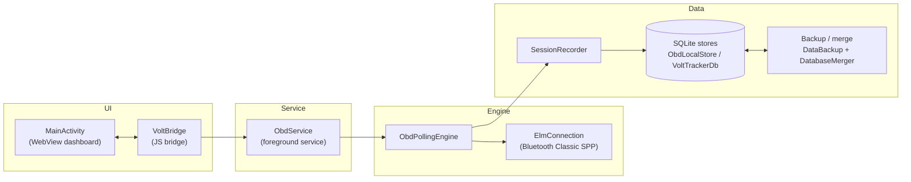
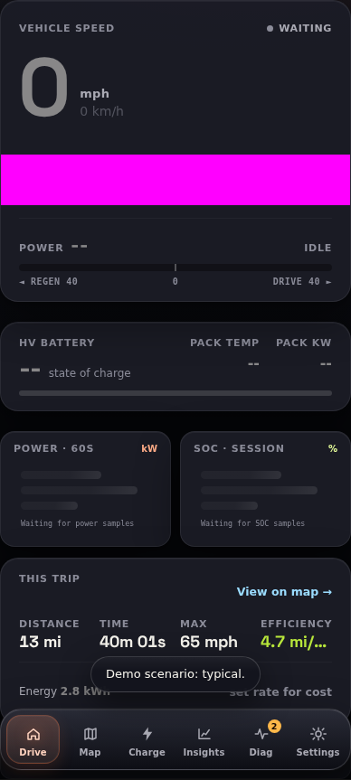
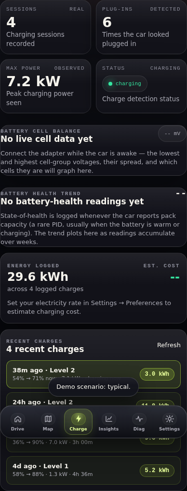
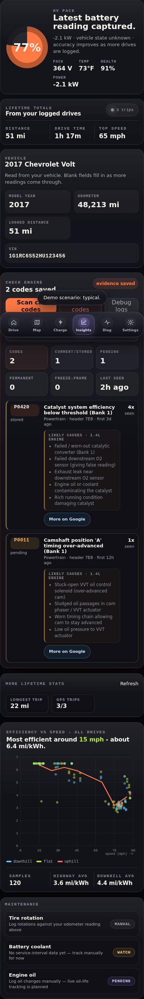

# Volt Tracker Android OBD POC

This is a standalone Android app for replacing Torque as the day-to-day OBD bridge.

It does three things:

1. Hosts a local Volt-style dashboard in an Android `WebView`.
2. Connects to a paired ELM327-style OBD2 adapter over Bluetooth Classic SPP.
3. Streams basic live OBD telemetry into the dashboard.

The app also includes a demo telemetry mode so the UI can be tested without a scanner.

## Features

Beyond live OBD streaming, the app ships these user-facing features:

- **Home-screen widget** — an at-a-glance vehicle snapshot (SOC, charging/connection
  state, and an "updated Xm ago" freshness line). Place it like any Android widget:
  long-press an empty area of the home screen → **Widgets** → find **Volt Tracker** →
  drag it out. Tapping the widget opens the app. The widget runs out-of-process and
  reads a compact persisted snapshot, so it shows the last known state even when the
  app is closed (see [`docs/adr/0007-event-notifications-and-widget-snapshot.md`](docs/adr/0007-event-notifications-and-widget-snapshot.md)).
- **Event notifications** — optional one-shot alerts for **charge complete**, a
  **new diagnostic code** appearing on a scan, **low SOC**, and **high pack
  temperature** (the last two are threshold alerts you configure in Settings). These
  post to a dedicated "alerts" notification channel. On **Android 13+ they require the
  `POST_NOTIFICATIONS` runtime permission** — grant it when prompted (or in Android
  app settings); without it the alerts are silently skipped, never crash. Toggle each
  alert and its threshold from the dashboard Settings screen.
- **Per-trip GPX / CSV export** — export any logged drive as a GPX 1.1 track or a CSV
  sample log from the Trips/Map view and hand it to any app via the Android share
  sheet (e.g. Strava, Garmin, a spreadsheet). These files contain **full-precision
  GPS coordinates and timestamps in plaintext** — see
  [`docs/privacy-data-handling.md`](docs/privacy-data-handling.md).
- **Maintenance log** — record service entries (type, free-text note, optional
  odometer and date) from the Insights screen. The log is independent of OBD
  sessions and is preserved when you clear stored OBD data.
- **Trip labels** — rename any logged drive; the label is keyed to the drive and
  survives trip re-detection. Clear it by saving an empty name.
- **Guided onboarding** — a first-run setup walkthrough (pair adapter → grant
  Bluetooth → grant location → connect or demo) that skips steps already satisfied.
  Re-open it any time from the **Setup guide** affordance.
- **Charge target SOC** — set a daily charge ceiling (e.g. 80%) on the Charge tab;
  the live-charge ETA targets it, and a one-shot **"charge target reached"** alert
  fires once per charge when the SOC crosses it (posted to the same alerts channel
  as the other event notifications).
- **Accessibility theme** — an Accessibility section in Settings with a **font-scale**
  multiplier (1×/1.25×/1.5×) and a **high-contrast, colorblind-safe** status-color
  toggle; animations also honor the OS **reduced-motion** preference.
- **Trip favorites** — star any logged drive and filter the Map/Trips list to
  favorites only. The flag is keyed to the drive and survives trip re-detection,
  like trip labels.

## Codebase Map

Production source layout under `app/src/main/kotlin/com/volttracker/obdpoc/`:

| Layer    | Files                                                                       | What it does                                                      | Entry point                |
|----------|-----------------------------------------------------------------------------|-------------------------------------------------------------------|----------------------------|
| UI       | `MainActivity.kt`, `VoltBridge.kt`, `assets/dashboard/*`                    | Hosts the WebView; bridges TypeScript calls back to the service   | `MainActivity.onCreate`    |
| Service  | `ObdService.kt`, `ObdNotifications.kt`, `PermissionGate.kt`                 | Foreground lifecycle, status broadcasts, runtime permissions       | `ObdService.onStartCommand`|
| Engine   | `ObdPollingEngine.kt`, `SessionRecorder.kt`, `ObdProtocol.kt`, `ElmConnection.kt`, `ObdElmDecode.kt`, `ObdProbes.kt`, `location/*` | Bluetooth IO, ELM327 init, polling loop, parsing, GPS | `ObdPollingEngine.runBluetoothLoop` |
| Data     | `data/*` (`ObdLocalStore`, `VoltTrackerDb`, `ObdStoreReports`, `ObdStoreTrips`, `ObdStoreSupport`, record DTOs) | SQLite schema, writes, queries, JSON projections for the dashboard | `ObdLocalStore`            |

Calls flow downward only (UI → Service → Engine → Data). See
[`docs/mobile-architecture-roadmap.md`](docs/mobile-architecture-roadmap.md#layering-rule)
for the full rule, and [`docs/adr/0001-webview-dashboard.md`](docs/adr/0001-webview-dashboard.md)
for why the dashboard is a WebView rather than Compose.

The dashboard `index.html` is generated by the Gradle `generateDashboardHtml`
task from `app/src/main/dashboard-src/partials/*.html`. Edit the partials, never
the generated file.

## Architecture

How the layers above connect at runtime (control path left-to-right, data path
branching off the polling engine):



The dashboard TypeScript calls into `VoltBridge` (the JavaScript interface
injected into the WebView); telemetry and status flow back to the page through
`DashboardPublisher`, which invokes allowlisted `window.VoltTrackerNative.*`
entry points. Everything below `ObdService` keeps running while the app is
backgrounded, which is why it is a foreground service.

### Dashboard screenshots

These are the committed Playwright visual-regression baselines (rendered at a
phone-like viewport on Linux CI), linked in place from
[`dashboard-e2e/`](dashboard-e2e/) — they refresh automatically whenever an
intentional UI change lands:

| Drive tab (typical telemetry) | Charge tab (sessions + detection) | Insights tab (full page) |
|---|---|---|
|  |  |  |

Solid magenta blocks are Playwright screenshot masks over nondeterministic
regions (live charts, Leaflet map tiles) — on a phone those areas show the
real chart/map.

### Dashboard Source Map

Dashboard behavior lives in `app/src/main/dashboard-src/js/*.ts` (bundled by
esbuild into the gitignored `assets/dashboard/js/`); each screen's markup is a
partial in `app/src/main/dashboard-src/partials/`.

| Screen / concern | TypeScript | Partial(s) |
|------------------|------------|------------|
| Shared namespace, state, Android bridge ABI, restore progress | `core.ts`, `telemetry.ts` | `topbar.html`, `error-banner.html`, `restore-progress.html` |
| Drive tab (live chips, speed/power/SOC charts) | `drive.ts` | `drive.html` |
| Trips list + Insights stats/scatter | `insights-panel.ts` | `insights.html` |
| Map tab (Leaflet, route scrubber, session list) | `map.ts`, `map-route-utils.ts`, `map-session-list.ts`, `scrubber.ts` | `map.html` |
| Charge history + storage summary + post-session review | `storage-status.ts` | `charge.html`, `settings.html` |
| Diagnostics: DTC lookup (lazy-loaded chunks) | `dtc-lookup.ts`, `dtc-causes.ts` | `diagnostics.html` |
| Detailed Signals (enhanced PID discovery) | `signals-panel.ts` | (rendered into `diagnostics.html`) |
| Connection status, tools, troubleshooter modal | `connection-status.ts`, `connection-tools.ts`, `troubleshooter.ts` | `connection-tools.html`, `troubleshooter.html` |
| Button wiring + lifecycle | `actions.ts`, `actions-demo.ts`, `actions-page-scroll.ts`, `actions-signals.ts`, `actions-storage.ts` | — |
| User preferences (loaded first in the bundle) | `prefs.ts` | `preferences.html` |
| In-app dialogs, demo data | `app-dialog.ts`, `demo-data.ts` | `app-dialog.html` |

Styles are plain CSS in `app/src/main/assets/dashboard/css/` (no build step).

## Setup

Use the pinned toolchain before running the full verification task:

- JDK 21. CI uses Temurin 21.
- Android SDK with platform 37 and build tools installed.
- Node 22. The root `.nvmrc` and `.node-version` both pin this.
- npm dependencies for the dashboard test/build and Playwright workspaces.

From `mobile/android/`:

```sh
npm --prefix dashboard-tests ci
npm --prefix dashboard-e2e ci
npm --prefix dashboard-e2e exec -- playwright install chromium
./gradlew verifyActiveApp
```

Useful local tasks:

```sh
./gradlew generateDashboardHtml          # rebuild assets/dashboard/index.html from partials
./gradlew verifyGeneratedDashboardClean  # fail if generated HTML is stale
./gradlew dashboardAssetReport           # print dashboard asset sizes and bundle-budget headroom
./gradlew verifyPerformance              # performance-focused dashboard + Android regression lane
./gradlew verifyStartupPerformanceOptional --no-configuration-cache
./gradlew :app:spotlessApply             # format Kotlin/Java and dashboard partials
./gradlew :app:testDebugUnitTest         # JVM/Robolectric unit tests
```

For install/release packaging details, see [`docs/release.md`](docs/release.md).
For performance review rules, see [`docs/performance-contracts.md`](docs/performance-contracts.md).
For release history, see the repo-root [`CHANGELOG.md`](../../CHANGELOG.md).
For common field failures, see [`TROUBLESHOOTING.md`](TROUBLESHOOTING.md).
Domain terms are defined in [`docs/glossary.md`](docs/glossary.md).

## Language Policy

Production Android source stays in `app/src/main/kotlin`; do not add production
Java back under `app/src/main/java`. Dashboard behavior source stays in
`app/src/main/dashboard-src/js/*.ts`; do not add source `.js` files there. The
Gradle `verifyNoMigrationSourceStragglers` task enforces both rules, and
`verifyActiveApp` runs that guard with the rest of the local validation suite.

## On-Phone Storage

The app now writes two layers of local data:

- Raw field-test JSONL files under app-private `files/obd-logs/`.
- Structured SQLite data in `volttracker_obd_poc.db`.

SQLite tables capture OBD sessions, parsed telemetry samples, status/debug events, and adapter history summaries. The Settings screen shows a database summary so field tests can confirm whether sessions and samples are being saved without pulling files from the phone.

For the data/privacy model, backup contents, and map tile network behavior, see
[`docs/privacy-data-handling.md`](docs/privacy-data-handling.md).

## Current PIDs

Live polling is tiered in `PidSchedule.kt`; every published sample carries
stale-age metadata so slower values can be shown honestly without slowing the
speed/RPM path.

| Lane | Cadence | PIDs |
|------|---------|------|
| Hot | Every cycle | `010D` speed, `010C` RPM, `0149` accelerator pedal, `222414` HV pack current |
| Warm | Every 2 cycles | `0104` engine load, `0111` ICE throttle, `222429` HV pack voltage |
| Slow | Every 6 cycles | `015B` hybrid battery SOC, `ATRV` adapter voltage |
| Thermal | Every 12 cycles | `0105` coolant temp, `22434F` HV battery temp |
| Deep | 24+ cycles | control-module voltage, run time, fuel/oil/odometer context, motor currents/voltages, PRNDL, charger HV voltage/current, charging mode/level, raw SOC, charge count, last-charge energy, and other validated context |

Diagnostic Scan and Detail Probe still exist for broader discovery, including
candidate TPMS probes. Do not promote new community Mode-22 formulas into live
polling until they have fresh field evidence from the target car.

## Build

From this directory:

```sh
# macOS / Linux
./gradlew :app:assembleDebug
```

```powershell
# Windows
.\gradlew.bat :app:assembleDebug
```

The debug APK will be at:

```text
app/build/outputs/apk/debug/app-debug.apk
```

### Pre-commit hooks (optional)

Run Spotless locally before each commit so format failures surface before CI:

```sh
brew install lefthook && lefthook install
```

### Full local verification

Before opening a PR, run the active-app verification task:

```sh
npm --prefix dashboard-tests ci
./gradlew verifyActiveApp
```

This runs Android unit tests, lint, Spotless, debug assemble, JaCoCo coverage,
dashboard ESLint/typecheck/Vitest, Playwright e2e, bundle budgets, generated
dashboard drift, and migration straggler guards. See
[`docs/validation-matrix.md`](docs/validation-matrix.md) for what this proves
and which real-device/real-car checks still need separate evidence.

Dashboard tooling is validated on Node 22 in CI and enforced by Gradle's
dashboard npm tasks. Use the root `.nvmrc` or `.node-version` when setting up a
local shell.

The aggregate task is configuration-cache ready. For faster repeated local
loops, run `./gradlew verifyActiveApp --configuration-cache`; the second run
should reuse the stored configuration.

### Startup and tab benchmarks

`verifyPerformance` is the checked-in regression lane for dashboard bundle size,
startup budgets, and Android perf contracts. `verifyStartupPerformanceOptional`
adds optional local startup checks that are useful before performance-focused
PRs, but it is not required for every edit because host/device timing varies.

For phone-specific timing, use the local adb scripts against a connected device
or wireless adb target:

```sh
bash tools/benchmark-adb-startup-local.sh <adb-serial-or-ip:port>
bash tools/benchmark-adb-tabs-local.sh <adb-serial-or-ip:port>
bash tools/device-baseline-local.sh <adb-serial-or-ip:port>
```

These scripts target only `com.volttracker.obdpoc`. They do not install,
uninstall, clear app data, or mutate the database, so they are safe to run
against a field-test phone that already has permissions accepted. Startup and
tab reports are written under `build/reports/adb-startup-benchmark/` and
`build/reports/adb-tab-benchmark/`, with trend JSONL files under
`build/reports/performance-trends/`.

The adb reports separate app-reported marks from host observation time:

- `appFirstFrameMs` and `appDashboardReadyProbeMs` measure when the WebView
  dashboard has painted and exposed the ready probe from inside the app.
- `jsTabSwitchMs` and `jsTabPaintMs` measure tab switch handling and first paint
  from dashboard JavaScript marks.
- `hostStartToReadyMs` and `hostStartToTabReadyMs` include adb, process launch,
  UIAutomator polling, and tap overhead, so use them for trend comparisons, not
  as pure app work.

The tab benchmark uses coordinate taps by default because accessibility text can
make host-side tap latency look worse than the app. Set
`VOLTTRACKER_TAB_TAP_STRATEGY=accessibility` when you specifically need the
accessibility path.

Large database timing can be checked from a pulled or backup SQLite file:

```sh
bash tools/benchmark-real-db-local.sh /path/to/volttracker_obd_poc.db
```

Keep durable baseline snapshots in
[`docs/performance-baseline-history.md`](docs/performance-baseline-history.md)
and the metric contract in
[`docs/performance-contracts.md`](docs/performance-contracts.md).

### Environment doctor

Run the no-network doctor when a new machine or agent shell behaves differently
from CI:

```sh
./gradlew doctor
./scripts/doctor.sh
```

These report Java, Android SDK, adb/device, Node/npm, dashboard dependency, and
Playwright readiness without installing anything. The Gradle task fails on
required runtime mismatches.

#### Running pieces individually

```sh
./gradlew :app:testDebugUnitTest                 # JVM/Robolectric unit tests
./gradlew :app:jacocoTestReport                  # coverage report (build/reports/jacoco/)
npm --prefix dashboard-tests run test:coverage   # dashboard Vitest + Istanbul coverage
```

`jacocoTestCoverageVerification` enforces ratcheting coverage floors a PR must
clear: **80% line coverage project-wide** and **90% for the `data/` package** (the
append-only persistence layer is held to a higher bar). Additional focused
per-package and per-class floors guard the pure-logic modules (`materialize`,
`classify`, `widget`, and feature deciders like `EventNotificationDecider`) so a
regression there can't hide behind the project aggregate — see `app/jacoco.gradle`
for the current values. The dashboard Vitest suite has its own Istanbul thresholds
in `dashboard-tests/vitest.config.js`.

### Outdated dependency report

List outdated direct and transitive dependencies (advisory; nothing fails):

```sh
./gradlew dependencyUpdates -Drevision=release
```

Dependency update policy is in [`docs/dependencies.md`](docs/dependencies.md).
Dependency snapshots and other dated audits are indexed in
[`docs/reports-index.md`](docs/reports-index.md).
The scheduled `Dependency snapshot` workflow refreshes the Gradle release
dependency report plus dashboard/e2e npm outdated and audit artifacts weekly.

## Install On A Phone

1. Pair your OBD adapter in Android Bluetooth settings.
2. Enable Developer Options and USB debugging.
3. Plug in the phone and accept the USB debugging prompt.
4. Run:

```sh
# macOS / Linux
adb devices
./gradlew :app:installDebug
```

```powershell
# Windows
adb devices
.\gradlew.bat :app:installDebug
```

Optional phone mirroring:

```sh
scrcpy
```

## Current Notes

- The app intentionally keeps a small dependency surface. Runtime code directly
  ships AndroidX Activity, AndroidX Core, and ProfileInstaller; test code uses
  JUnit, Robolectric, and `org.json`.
- Bluetooth permissions are requested at runtime on Android 12+.
- A foreground service keeps the OBD session alive while polling.
- The WebView only loads local assets from `app/src/main/assets/dashboard`.
- The Map and Trips route views use remote CARTO basemap tiles by default, with
  OpenStreetMap fallback when CARTO is unavailable. Route, OBD, and GPS history
  still come from on-device storage, but tile providers can see requested tile
  coordinates.
- The service uses the standard ELM327 serial UUID: `00001101-0000-1000-8000-00805F9B34FB`.

Fresh graded audits are written to `.Codex/grade-report.md`, which is repo-local
and gitignored. Historical tracked reports remain under `docs/`.

## Pulling Field-Test Logs

Every connect or demo session writes JSONL logs on the phone under app-private storage:

```text
files/obd-logs/session-*.jsonl
files/obd-logs/latest.txt
```

After reconnecting the phone with USB debugging:

```powershell
$pkg = "com.volttracker.obdpoc"
$out = "C:\Users\Justin\OneDrive\Documents\Github\VoltTracker\mobile\android\field-test-latest.jsonl"
$latest = adb shell run-as $pkg cat files/obd-logs/latest.txt
adb exec-out run-as $pkg cat "files/obd-logs/$latest" > $out
```

Those logs include status transitions, connection failures, every ELM327 command and response, parsed telemetry samples, timing, empty responses, and whether the adapter prompt (`>`) was seen.

The SQLite database can also be pulled after a test:

```powershell
$pkg = "com.volttracker.obdpoc"
$out = "C:\Users\Justin\OneDrive\Documents\Github\VoltTracker\mobile\android\field-test-db.db"
adb exec-out run-as $pkg cat databases/volttracker_obd_poc.db > $out
```
